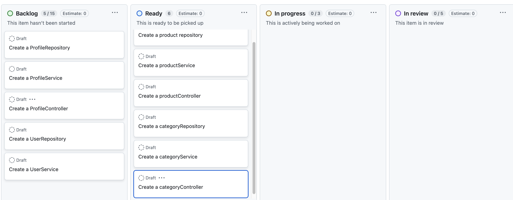

# EasyShop

### During this Spring Boot project with MySQL Database, our objectives were to work on the backend of an e-commerce shop, adding functionalities such as adding items to a cart, updating profiles, checking out, and testing using Postman collections.

## Table of Contents
- [Requirements](#requirements)
- [Usage](#usage)
- [How it Works](#how-it-works)
- [Screenshots](#screenshots)

## Requirements
- [Git](https://git-scm.com/downloads)
- [Java 21](https://www.oracle.com/th/java/technologies/downloads/) or Higher
- [MySQL](https://www.mysql.com/) 8.0 or higher
- [Maven](https://maven.apache.org/) for dependency management
- [IntelliJ IDEA](https://www.jetbrains.com/idea/download/)
- [Spring Boot](https://spring.io/projects/spring-boot) 2.7.3
- [Postman](https://www.postman.com/downloads/) for testing

## Usage
1. Clone the repo:
``` 
    git clone git@github.com:Saidakramov/EasyShop.git
```
2. Launch Project in IntelliJ IDEA:
    - Click Open and select project directory.
3. Update `application.properties` in `/capstone-starter/src/main/resources/`
   ```
   # Server configuration
   server.port=8080
   
   # Database config
   datasource.url=${datasource.url}
   datasource.username=${datasource.username}
   datasource.password=${datasource.password}

    spring.jpa.hibernate.ddl-auto=none
    spring.jpa.hibernate.naming.physical-strategy=org.hibernate.boot.model.naming.PhysicalNamingStrategyStandardImpl
    spring.jpa.hibernate.naming.implicit-strategy=org.hibernate.boot.model.naming.ImplicitNamingStrategyLegacyJpaImpl
    spring.jpa.properties.hibernate.dialect=org.hibernate.dialect.MySQL8Dialect
    spring.data.jpa.repositories.enabled=true


    #jwt.secret=T9GKvpb3oX5qqo3sd6+OJ2iqldexr32h7FHMpkgON+6yAtr2gfJOQkjt4mR9b7rCPL3wip8vgXzkr2LOpbAnitVQvHnIO2tlaQdnPo+xc10/KtcEBDMQV6nPn41+ScZ9wbvTIQn2+FUoJkQhXFcWRe4r4CbDKzZ73Z4ZyhMmJ4n8crYDl7dR3XjScLq4sO0BXYHK1qj6u7JPABoqQXv83uycysTt/TtDIxSl5r5+M7U/99hHvdLmfWBUlCoorhGodggZow/6qlSql7jRLENwebcxrd9Ggxaf5BA+oR6FJ1gwCEIPOoSs+Cbk7SQwIgOIw8Xmmn+nbZzPoDugv80Diy/QRUQ0rs/F8lgBG8P3dq7mLWaJknSlOquxBCcnkBaMHvtPARqrnNhlfXl5pTXvuGl+wbwDLi5WGOb0go+b+gv2Z/xtOu72t41sf/PjNkDQPiCzoSmagQA/aRAg2z5Mfewl16eeB96h8MHeDUjSzsVNpw8/NySUnVbRKXjxeZG2P6IsRoGMPeufEz/2uexIvoLCb76t+IjCDWwwdULrofFFMyb2wv3+7mpTlCkyAJp5x7SMFiBjqGRfa1Ziy1iq8uHxzVLJTKZp0w2EDzGI/uvn95b8gEtckWFkPmACi7ESXxVDRgWEFHW6Hr742uPl6walIEEZvxbIrgpaszaSonM=
    jwt.secret=q8iMBSth1xu3cC+YWZPd/4XyelVYi2Bo3qr4dC1ugJL+bShsS6NTviJMdgC3rwIE7pRmxQIFzWpQW1Yb5XGWcZ1vpxs5afVogHNDZhyi5gOj8FsdRZnNLJz7P3PjGMi8whO0l9vnHRAKv5ZSoBQ7bw9KNUw7yoFGXuoGUEa9HsUyM56MKx6xVpxdFFeLkoHF3BU4hSkD7VDghZs2BzmOa1YcyN76qGY6nH5zjD1Gwea1NpxXTS6VvYF1qEchz2hGdZHNHE9T0QpBzeGsDJssYJ2zi9PZwjfZECyYyFiZC5jwDyD2oLkI6C95db8bf2KzI/g8FcBGNT2XG6HswnPtGeUfMqekk3xjJMK3iHfR6Q7y1I7D8ivjqP0oUDycT6f9rx3N6RbDfKTG9krAxzcCX9+gqR6GJO+x3moX82aZyW5WfgXek2uKGJJjP2pMnyoI6C/Uj8RAd3jAbhptx5/hQ91fxJiybG9RvfhPQEXyEYOMsI+Ve4rVd0JGneiD9azN2GzStQey9g7uGm04bE1Y+GgC/mSxIi5PIMhSPd+rBb7Sx3JJk1f7nH68iK+iXjtRGLFm0avq+2RiV4aw1nvQksh0aiMjDSZXqWpeN7o1oHe+FK1EeS4B2k3t+k6NU06QDmlGh6W1SjU2sJx0X+hxXU/IpDVgN5N0xfG9m3sQjFOLUQHbzqYceCstwIq3tsWZ+xhH/D51k36mR+sQ3xk8Jw3tj6Gd4w9jhIwAWY5/wf2T2VNrmYdR08H0BdMv8uR+lfmfbz+/vT+EAAAA==
    jwt.token-timeout-seconds=108000

    ```
4. Run `create_database.sql`, located in `/capstone-starter/database/` in your MySQL Workbench, to create and seed the database.

5. Run the Application
    - Open `EasyShopApplication.java` file inside `src/main/java/com/pluralsight` directory.
    - Right-click on the `EasyShopApplication` class and select `Run EasyShopApplication.main()`
6. Open the Live Server
    - Open `home.html` file located in `capstone-client-web-application/templates`, pick the preferred browser type provided in the IntelliJ IDEA top right corner.
7. Login as User and interact with the website
   - Login using the below credentials:
   - Username: gary
   - Password: thePass
   
## How It Works
- `Login` logs in or out users and admins.
- The `Home` button directs users to the main page.
- `Filter` helps users filter based on Categories, minimum or maximum price, and color preference.
- The `Profile` shows detailed information, such as the user's name, last name, and address. If it's empty, the user can input the information and click the update button to save it.
- The `Views Cart` or `Cart Icon` on the right directs users to the cart to view added products and their quantities.

## Screenshots
### Projects
